# HomeCook(回家吃饭)
How to sniff traffic of homecook and scrape all the kitchen list.Do some analysis!

## Requirment
### Charles 

download:[https://www.charlesproxy.com/download/][1]

Homeccok doesn’t have set up https for now, so don’t need to install SSL CA Certificate on your computer or mobile phone.

If you need that, just do it as the instruction here:[https://www.charlesproxy.com/documentation/using-charles/ssl-certificates/][2]

### The Same LAN

Your computer and mobile phone should be in the same LAN ,then configure your computer which installed Charles to the proxy server of your mobile phone. Hence all the traffice from mobile  will pass through the computer.

## Step By Step

### Launch The App

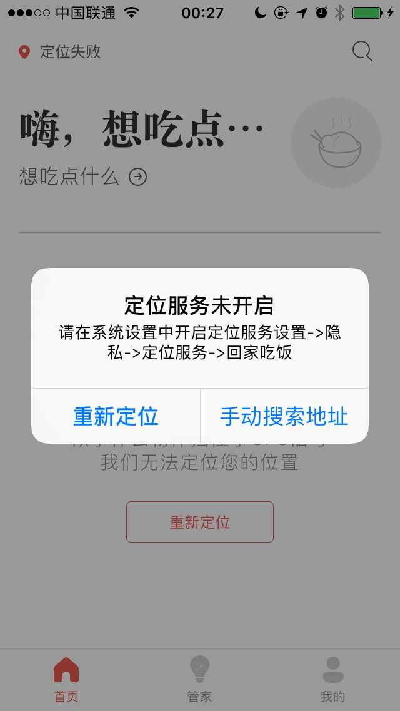

Before launching the app , you need to disable the location service of Homecook . Once launching it will pop up a notifician shows above, then press ‘手动搜索地址’. Disable of location service it couldn’t send your location to the server automaticly. so it will let you set up a location manually. 

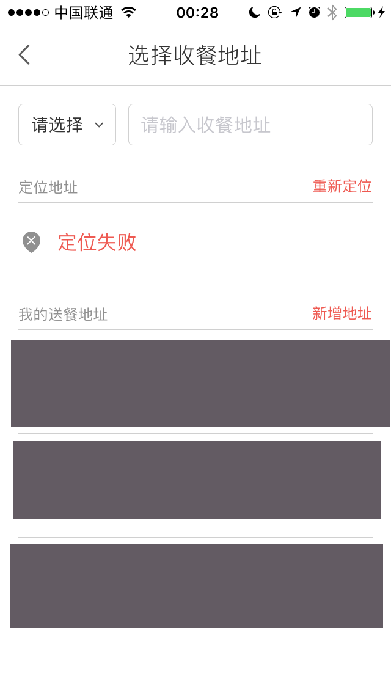

OK, after pressing ‘Manually search address’ , you will get this page shows above. Here we just take ‘中关村’ for an example. When you type  ‘中关村’ into the input box, Homocook will send you some suggestion addresses such as  ‘中关村’、’中关村(地铁站)’ . It’s very important here . In the meantime you should  keep observation the Charles to find out which host the app is sending data to.

Here I choose the first address ‘中关村’, getting the results shows above.First kitchen ‘咸鱼不咸’, Second one ‘遇见东北菜’. You are almost there.

### Monitor the traffic

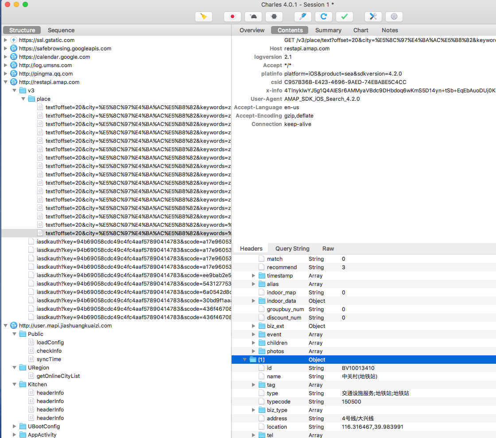

The first step finished here. We should check the Charles to see what we have gotten by now.

Yes ! The suggestion address ! We couldn’t find all the kitchen list by an aggregation page . But if we send the all the address in beijing or some special city to the server and what will happen? A full list with almost the kitchen list around that place.

So where and how to get all the addresses ? I will tell you that in next step.

Back here. Continue search the kitchen list that we need.

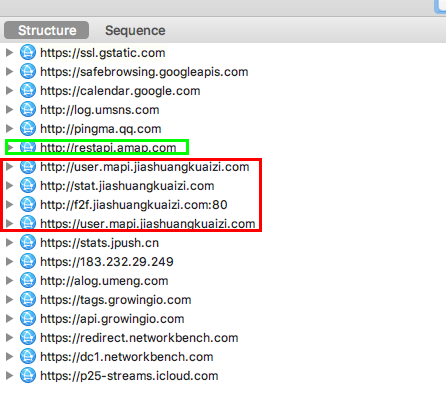

As you can see above the image, the urls in red box are the requests from homecook. So next step find out which url is the right one that we need .

Extract all the directory of every url one by one. Finally got this one with ‘kitchenList’

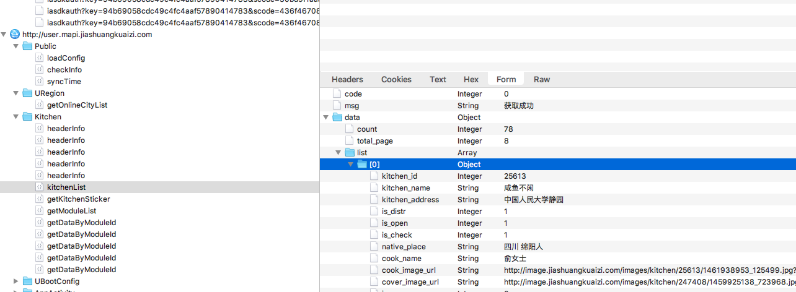

### Simulating the requests

‘闲鱼不咸’ , the kitchen we saw in the app. I think that we already find the requests from homecook to get kitchen list . And now, how to simulate the requests?

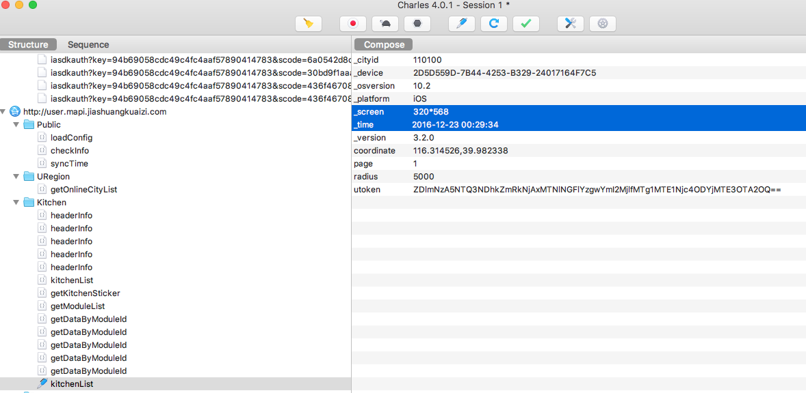

Charles, the best traffic monitor tools ever used , has a function that you could compose a new request with the request data sent above. Of course, you can edit it too. So here we just compose a new request to check whether or not we could get the data.

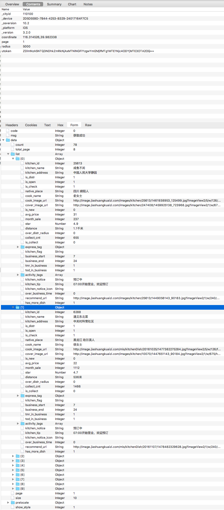

Compose and execute . Nothing changed. Bingo! The same data likes above.

By now , we almost finished half of the project . What we should do next is writing some python code to get all the kitchen list here.

### Send requests with python

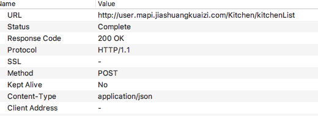

Copy the header and content in form to a code editor , and formate it like the code shows below.

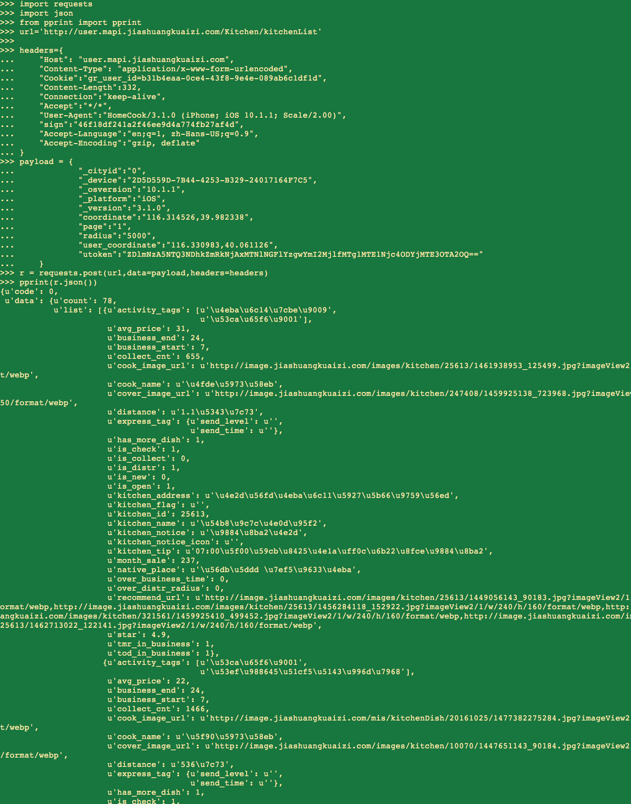

The ‘url’ is the destination that the app send requests to. Headers and payload should be a dict .Then import json and requests.  Send the requests! 

Print the json code in a beautiful format with pprint function. The name and tags here are unicode characters so you can ensure the data by avg_price or_business_start. Or type in ‘print r.json()[’data’]()[’list’]()[’activity_tags_’](). The unicode characters will show up._
  
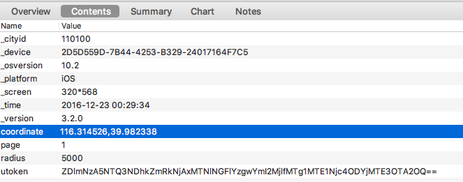

Something you should notice here is the coordinate .If you change the address you put in Step one , the coordinate will change too. The coordinate belongs to the address!

Here we get the kitchen list of ‘中关村’. If we have an list includes all the addresses like it , then we will get all the kitchen list.So next step we will find the list.

### Find Address list

We will get the list from some online service such as 58, ganji or 大众点评. These service has the most detialed address list. Scraping the list doesn’t have much difference from each other. so we take 大众点评 for an example.

The homepage of 大众点评 shows like above. Pay attention to the ‘所有地区’ section. We could filter all the restaurants by region here . Below Every district it has so many detailed address name. So just scrape all of them!

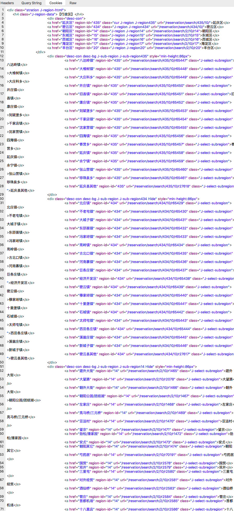 

It’s so simple here. Parse it with BeautifulSop. Nothing more to say. If any questions please feel free to open an issue or email me.

But , wait! Only the address name , where is the coordinate ? 

Have you notice that requests when we type in an address name in homecook app? The amap! The biggest online location service , 高德地图！Send all the address to it ,and get the coordinates! It's simple!
 

[1]:	https://www.charlesproxy.com/download/
[2]:	https://www.charlesproxy.com/documentation/using-charles/ssl-certificates/ "SSL Certificates"
[8]:	()
[9]:	()
[10]:	()
[11]:	()
[12]:	()
[16]:	()
[17]:	()
[18]:	()
